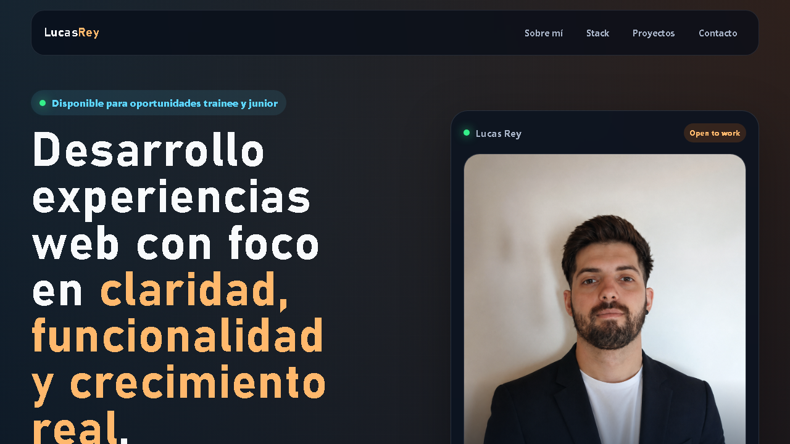

# Portfolio Lucas Rey

Portfolio personal desarrollado con Vue 3 y Vite para presentar experiencia, stack y proyectos destacados en una sola landing.

## Demo

- Vercel: https://portfolio-lucas-rey.vercel.app

## Vista previa



## Secciones

- Presentacion principal
- Sobre mi
- Skills
- Proyectos
- Contacto

## Tecnologias utilizadas

- Vue 3
- Vite
- CSS
- JavaScript

## Objetivo del proyecto

Este portfolio esta pensado para mostrar de forma clara:

- Mi perfil como desarrollador
- Los proyectos mas representativos que tengo publicados
- Mi stack actual y el tipo de aplicaciones que estoy construyendo

## Ejecutar en local

```bash
npm install
npm run dev
```

## Build de produccion

```bash
npm run build
```
